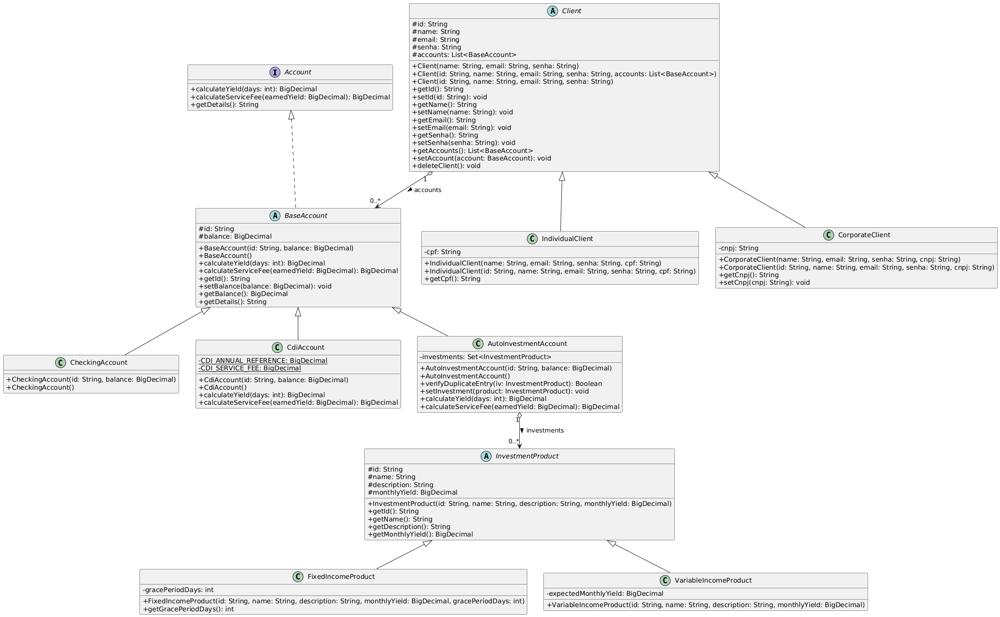

# VcRiquinho - Sistema de Gestão e Alocação de Investimentos

Protótipo de sistema desenvolvido para a startup de investimentos **VcRiquinho**, focado na gestão e alocação estratégica de recursos de clientes conforme perfis específicos de investimento. O sistema calcula rendimentos, aplica taxas de serviço e gerencia produtos financeiros de renda fixa e variável através de uma arquitetura robusta.

---

##  Tecnologias e Arquitetura

O projeto foi construído seguindo os princípios de **Programação Orientada a Objetos (POO)** em **Java**, estruturado em camadas[cite: 1]:
* **`model`**: Classes de domínio, hierarquia de clientes e contas.
* **`view`**: Interface de linha de comando para interação com o operador.
* **`controller`**: Controladores de regras de negócio (como o `ClientController`)[cite: 1].
* **`dao`**: Camada de persistência integrada com banco de dados **MySQL** utilizando **Stored Procedures**[cite: 1].

---

##  Principais Funcionalidades

1. **Gestão de Clientes:** Suporte completo (CRUD) para Pessoa Física (`IndividualClient`) e Pessoa Jurídica (`CorporateClient`) sob a superclasse `Client`[cite: 1].
2. **Modalidades de Contas:** Contas correntes (`CheckingAccount`), contas CDI (`CdiAccount`) e contas de auto-investimento (`AutoInvestmentAccount`) estendendo `BaseAccount`[cite: 1].
3. **Produtos Financeiros:** Gerenciamento de produtos de Renda Fixa (com período de carência) e Renda Variável[cite: 1].
4. **Simulação de Rendimentos e Taxas:**
   * Cálculo de rendimentos por parâmetros de tempo (30, 60, 90 ou 120 dias)[cite: 1].
   * Aplicação de taxas específicas (ex: 0,07% para CDI; 0,1% para PF e 0,15% para PJ em contas de auto-investimento)[cite: 1].
   * Desconsideração automática de produtos de renda fixa dentro do período de carência[cite: 1].
5. **Banco de Dados Seguro:** Utilização de procedimentos armazenados (`vcRiquinhoDB`) e regras de integridade como `ON DELETE CASCADE`[cite: 1].

---

##  Modelagem Orientada a Objetos (Diagrama UML)

O sistema adota polimorfismo dinâmico para o cálculo de rendimentos (`calculateYield`) e taxas de serviço (`calculateServiceFee`)[cite: 1]. Abaixo está a representação conceitual da hierarquia de classes do projeto:

